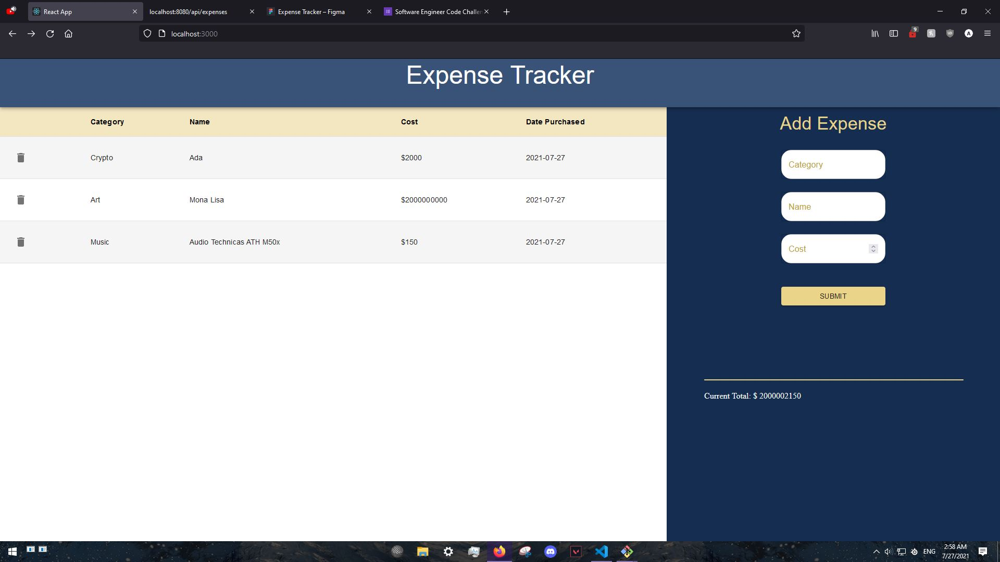

# Expense-Tracker

This project allows users to keep track of their spending! Our main functionality includes:

- Adding an expense
- Deleting an expense that was created
- A total spending

Users may create an expense by inserting a name and a cost. Optionaly you can also insert a category. If you make a mistake, you can always press the trash can icon on the left of the entry in order to delete said entry.

The site was designed on figma before any implmentation can into play. Feel free to take a look at my original design! 

[Figma link](!https://www.figma.com/file/wzvS6Jqqg0Cgqj2JyCTecR/Expense-Tracker?node-id=0%3A1)

## Getting Started

1. Open up a command line and navigate to api/db
2. If testing, open up psql and create a user called development with the password development. Otherwise please create a .env file with the following variables you'd like to use.

- user: `labber`
- password: `labber`
- database: `expenses`
- host: `localhost`
- port: `5432` //this is your database port

3. run the create.sql script using psql. This should create an expenses database, table, and a sample entry. Once this is done, grant the above user all permissions to the new database.
4. We'll now exit psql and open up an additional terminal and navigate to the client folder.
5. Install dependencies: `npm i` on both the client and the api
6. Once the installation is done, we can run the server: `npm start`
7. Visit `http://localhost:3000/`

Note: app is not tested with environment variables

## Technologies Involved

- PostgreSQL DB
- Express server
- Material-UI framework
- Node.js

## Screenshots

## Known Bugs

- Category not auto populating with "Other" when missing content

## Potential new Features and patches

- Bugfixes
- Adding "(optional)" to category placeholder (once bug is fixed)
- Bulk delete through checkboxes
- Adding Monthly total
- Sorting by column
- Implementing a test suite
- Hosting through herokuapp
- Psql hosting through elephantSql

## Maintainers

- Alvin Ng 
